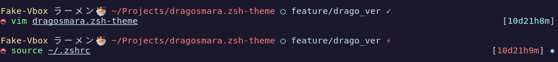

# dragosmara - modified daivasmara.zsh-theme
> changes: text, prompt char, removed commit tag

**ラーメンく**: Ramen

**◓**: Pokeball Unicode

Terminal: [Alacritty](https://github.com/alacritty/alacritty)

Color Scheme: [Challenger Deep Theme](https://github.com/challenger-deep-theme/alacritty)

## Installation

[https://github.com/ohmyzsh/ohmyzsh/wiki/Customization#overriding-and-adding-themes](https://github.com/ohmyzsh/ohmyzsh/wiki/Customization#overriding-and-adding-themes)

## Original Author and Repository:

Daivasmara – [github](https://github.com/daivasmara) – daivasmara@gmail.com

Distributed under the MIT license. See ``LICENSE`` for more information.

[https://github.com/daivasmara/daivasmara.zsh-theme](https://github.com/Daivasmara/daivasmara.zsh-theme)
